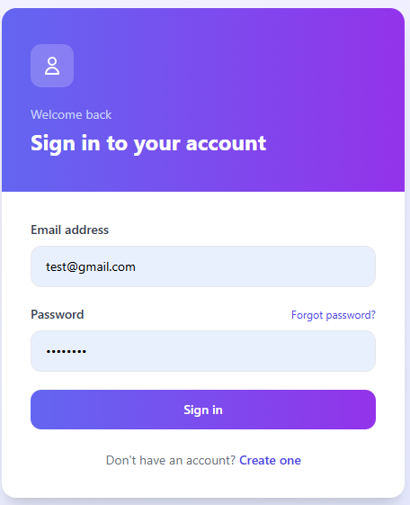
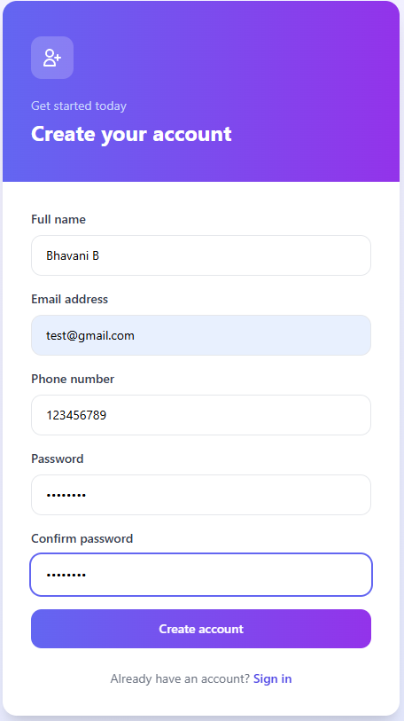
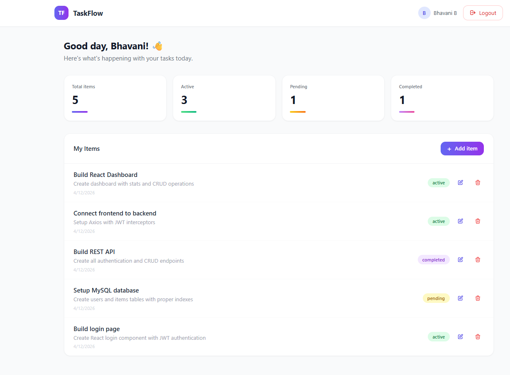
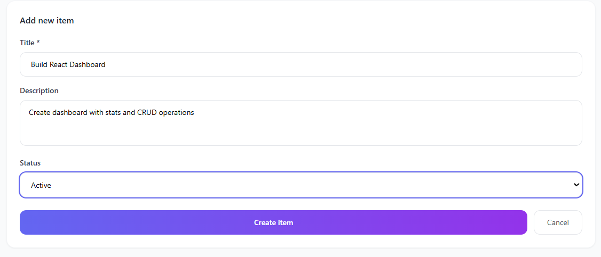
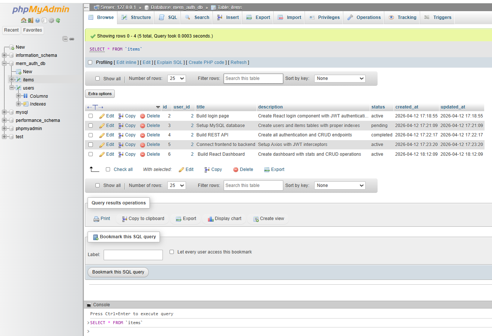

# 🔐 MERN Stack Auth System with MySQL

A full-stack authentication system with dashboard CRUD operations built using React.js, Node.js, Express.js and MySQL.

**Institution:** CampusPe | **Mentor:** Jacob Dennis

---

## 🛠️ Tech Stack

| Frontend | Backend | Database | Auth |
|----------|---------|----------|------|
| React.js | Node.js | MySQL | JWT |
| Tailwind CSS | Express.js | mysql2 | bcryptjs |
| Axios | Nodemailer | — | — |
| React Router | — | — | — |

---

## 📁 Project Structure
mern-mysql-auth-crud/
├── backend/
│   ├── config/db.js
│   ├── controllers/
│   │   ├── authController.js
│   │   └── itemController.js
│   ├── middleware/
│   │   ├── auth.js
│   │   └── errorHandler.js
│   ├── routes/
│   │   ├── authRoutes.js
│   │   └── itemRoutes.js
│   ├── .env.example
│   ├── server.js
│   └── package.json
├── frontend/
│   └── src/
│       ├── api/
│       │   ├── axios.js
│       │   ├── authApi.js
│       │   └── itemApi.js
│       ├── context/
│       │   └── AuthContext.jsx
│       ├── components/
│       │   ├── Login.jsx
│       │   ├── Register.jsx
│       │   ├── ForgotPassword.jsx
│       │   ├── ResetPassword.jsx
│       │   ├── Dashboard.jsx
│       │   ├── ProtectedRoute.jsx
│       │   └── PublicRoute.jsx
│       ├── App.jsx
│       └── main.jsx
├── screenshots/
├── database.sql
└── README.md

---

## 🗄️ Database Setup

```bash
# 1. Start MySQL in XAMPP Control Panel
# 2. Open http://localhost/phpmyadmin
# 3. Click SQL tab → paste database.sql → click Go
```

---

## ⚙️ Installation

### Backend
```bash
cd backend
npm install
npm run dev
```

### Frontend
```bash
cd frontend
npm install
npm run dev
```

### Environment Variables
Create `.env` inside `backend/` folder:

```env
PORT=5000
DB_HOST=localhost
DB_USER=root
DB_PASSWORD=
DB_NAME=mern_auth_db
JWT_SECRET=your_secret_key
JWT_EXPIRE=7d
EMAIL_HOST=smtp.gmail.com
EMAIL_PORT=587
EMAIL_USER=your_email@gmail.com
EMAIL_PASS=your_app_password
```

---

## 🔗 API Endpoints

### Auth `/api/auth`

| Method | Endpoint | Access |
|--------|----------|--------|
| POST | `/register` | Public |
| POST | `/login` | Public |
| POST | `/forgot-password` | Public |
| POST | `/reset-password` | Public |
| GET | `/me` | 🔒 Protected |

### Items `/api/items`

| Method | Endpoint | Access |
|--------|----------|--------|
| GET | `/` | 🔒 Protected |
| GET | `/:id` | 🔒 Protected |
| POST | `/` | 🔒 Protected |
| PUT | `/:id` | 🔒 Protected |
| DELETE | `/:id` | 🔒 Protected |
| GET | `/stats` | 🔒 Protected |

---

## ✅ Features

- [x] Register and login with JWT authentication
- [x] Password hashing with bcryptjs
- [x] Password reset via email
- [x] Protected and public routes
- [x] Dashboard with stats — Total, Active, Pending, Completed
- [x] Full CRUD — Create, Read, Update, Delete items
- [x] Delete confirmation dialog
- [x] Auto logout on token expiry
- [x] SQL injection prevention with parameterized queries
- [x] Responsive design with Tailwind CSS

---

## 📸 Screenshots

| Login | Register | Dashboard |
|-------|----------|-----------|
|  |  |  |

| CRUD Operations | MySQL Database |
|----------------|----------------|
|  |  |

---

## 🛠️ Troubleshooting

| Problem | Fix |
|---------|-----|
| MySQL connection error | Start MySQL in XAMPP |
| Port already in use | Change `PORT=5001` in `.env` |
| Token failed | Login again for fresh token |
| Module not found | Run `npm install` again |

---

## 👩‍💻 Author

**Bhavani B** — CampusPe Full Stack Development 2026
GitHub: [@bhavanirb](https://github.com/bhavanirb)